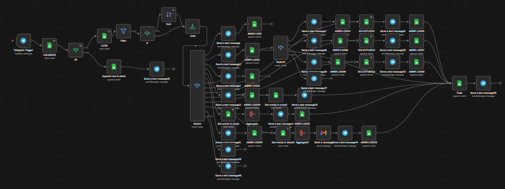

# HelpDeskBot 🤖🆘

**HelpDeskBot** es un asistente conversacional automatizado diseñado para la gestión integral de solicitudes de soporte interno. Optimiza el registro de incidentes técnicos, gestiones administrativas y consultas generales mediante flujos lógicos controlados, asegurando que la información llegue estructurada a los responsables.

El sistema se basa en una arquitectura de **automatización de bajo código (Low-Code)**, priorizando la estabilidad y la trazabilidad de cada interacción.

## 🚀 Tecnologías Utilizadas

* **Motor de Lógica:** [n8n Community Edition](https://n8n.io/)
* **Plataforma de Interacción:** [Telegram Bot API](https://core.telegram.org/bots)
* **Persistencia de Datos:** [Google Sheets API](https://developers.google.com/sheets/api)
* **Notificaciones:** SMTP (Correo electrónico) e integraciones de mensajería.

## 🛠️ Arquitectura y Flujo de Trabajo

A diferencia de los bots basados en IA generativa, **HelpDeskBot** utiliza un modelo de navegación por estados y opciones numéricas. Esto garantiza:
1.  **Cero alucinaciones:** El bot siempre responde según el flujo definido.
2.  **Guía estructurada:** El usuario es llevado paso a paso (Wizard) hasta completar su requerimiento.
3.  **Trazabilidad total:** Cada paso se registra en un sistema de logs.

### 📊 Diagrama del Flujo (n8n Workflow)

A continuación, se presenta la representación visual del flujo lógico implementado. Este diagrama muestra la interconexión entre el disparador de Telegram, los nodos de control de flujo (Switch/If) y la persistencia en Google Sheets:

  

### Modelo de Datos (Google Sheets)
El bot utiliza una hoja de cálculo denominada `HelpDeskBot_DB` con la siguiente estructura:

| Hoja | Campos Clave |
| :--- | :--- |
| **SOLICITUDES** | `id_ticket`, `tipo`, `prioridad`, `descripcion`, `estado`, `creado_por`, `fecha` |
| **USUARIOS** | `telegram_id`, `nombre`, `rol`, `activo` |
| **LOGS** | `timestamp`, `telegram_user`, `pantalla`, `opcion`, `resultado` |

## 📖 Experiencia del Usuario (UX)

El bot implementa una interfaz humanizada pero técnica, utilizando un menú principal numerado:

* **Menú Principal:**
    * `0.` Ayuda y soporte del bot.
    * `1.` Crear solicitud (Soporte, Admin, General).
    * `2.` Consultar estado de un ticket específico.
    * `3.` Listado de "Mis solicitudes".
    * `4.` Reportes de gestión.
    * `5.` Configuración de perfil.

## ⚙️ Automatizaciones Core

El flujo de n8n ejecuta de manera obligatoria las siguientes tareas:
1.  **Validación de Usuario:** Verifica si el `telegram_user` está activo en la base de datos antes de permitir cualquier gestión.
2.  **Wizard de Creación:** Captura de forma secuencial Tipo $\rightarrow$ Prioridad $\rightarrow$ Descripción.
3.  **Persistencia:** Registro inmediato en la hoja `SOLICITUDES` con estado inicial "Pendiente".
4.  **Sistema de Auditoría (LOGS):** Cada interacción del usuario se guarda para análisis de cuellos de botella en el flujo.

## 📋 Requisitos e Instalación

1.  **Clonar el Workflow:** Importar el archivo JSON del flujo en tu instancia de n8n.
2.  **Configurar Credenciales:**
    * Crear un bot en `@BotFather` y obtener el Token.
    * Configurar el acceso a Google Cloud Console para la API de Sheets.
3.  **Estructura de Sheets:** Asegurarse de que el documento `HelpDeskBot_DB` tenga las cabeceras exactas mencionadas en el modelo de datos.

---
Desarrollado por Alejandro Andres Sanchez Carrillo - 2026